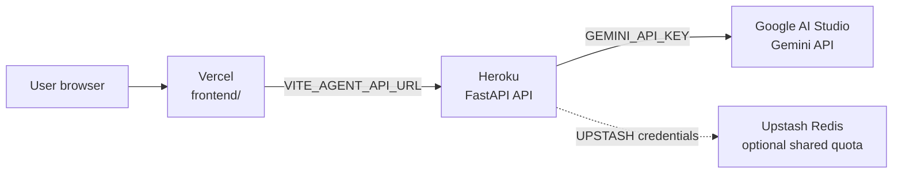

# DataSnap Deployment

> **Deploy a decision-intelligence app in two services.**
>
> DataSnap turns a business question and an uploaded dataset into a decision brief with verified metrics, charts, recommendations, and downloadable reports. This guide takes a fresh clone from zero to a working production deployment.

<p align="center">
  <strong>React + Vite</strong>&nbsp;&nbsp; · &nbsp;&nbsp;<strong>Vercel</strong>&nbsp;&nbsp; · &nbsp;&nbsp;<strong>FastAPI</strong>&nbsp;&nbsp; · &nbsp;&nbsp;<strong>Heroku</strong>&nbsp;&nbsp; · &nbsp;&nbsp;<strong>Gemini</strong>
</p>

## The Deployment Shape

DataSnap is deployed as a frontend and a backend. The browser talks to the Heroku API; Gemini and any Redis credentials stay on the backend.



### What gets deployed where

| Service | Platform | Repository setting | Public value |
| --- | --- | --- | --- |
| Frontend | Vercel | Root Directory: `frontend` | `https://<project>.vercel.app` |
| Backend | Heroku | Repository root + root `Procfile` | `https://<app>.herokuapp.com` |
| Model provider | Google AI Studio | Key stored in Heroku only | Never expose the key to Vercel |
| Shared quota store | Upstash Redis | Optional Heroku Config Vars | REST URL and token stay private |

## Before You Start

You need:

- Access to the GitHub repository.
- A Heroku account and the [Heroku CLI](https://devcenter.heroku.com/articles/heroku-cli).
- A Vercel account connected to GitHub.
- A Gemini API key from [Google AI Studio](https://aistudio.google.com/).
- An Upstash account only if quota state must survive dyno restarts or be shared across dynos.
- Git, Python 3.11+, Node.js, and npm for local verification.

> **Security boundary:** never put `GEMINI_API_KEY`, Redis tokens, or signing secrets in Vercel variables, `frontend/.env`, source code, or a committed `.env` file. Any variable beginning with `VITE_` is shipped to the browser.

## 1. Get the Code

Clone the repository you are deploying:

```bash
git clone https://github.com/bilalhaider-ux/ai_agent_01.git
cd ai_agent_01
```

Confirm the deployment files are present:

```bash
test -f Procfile && test -f requirements.txt && test -f frontend/vercel.json
```

The Heroku `Procfile` must be at the repository root. The Vercel project will use `frontend` as its root directory.

## 2. Create the Gemini Credential

1. Open [Google AI Studio](https://aistudio.google.com/).
2. Sign in and select or create a Google project.
3. Choose **Get API key** and create a key.
4. Keep the key private. You will add it to Heroku as `GEMINI_API_KEY` in the next step.

The application uses Gemini for planning, code generation, and report synthesis. A key is required for the production provider. Do not test by pasting it into the frontend.

## 3. Create and Configure the Heroku Backend

### Create the app

Log in and create a unique app. The app name becomes part of its public URL:

```bash
heroku login
heroku create <your-backend-app-name>
```

Your backend URL will be:

```text
https://<your-backend-app-name>.herokuapp.com
```

If the app already exists, connect the local repository instead:

```bash
heroku git:remote --app <your-backend-app-name>
```

### Add production Config Vars

Generate the signing secret locally:

```bash
openssl rand -hex 32
```

Set the required values. Replace every angle-bracket placeholder before running this command:

```bash
heroku config:set \
  LLM_PROVIDER=gemini \
  GEMINI_API_KEY="<key-from-google-ai-studio>" \
  GEMINI_MODEL=gemini-3.1-flash-lite \
  GEMINI_FALLBACK_MODELS=gemini-3.5-flash-lite,gemini-2.5-flash-lite \
  CORS_ALLOWED_ORIGINS="https://<your-vercel-domain>" \
  COOKIE_SECURE=true \
  RATE_LIMIT_SECRET="<output-from-openssl>" \
  MAX_REQUESTS_PER_HOUR=5 \
  MAX_RETRY_COUNT=3 \
  EXECUTION_TIMEOUT_SECONDS=45 \
  MAX_UPLOAD_SIZE_BYTES=52428800 \
  --app <your-backend-app-name>
```

`CORS_ALLOWED_ORIGINS` is temporary until the Vercel URL is known. After the frontend deploys, set it again with the exact final origin and no trailing slash.

### Optional: connect Upstash Redis

Create a Redis database at [Upstash](https://upstash.com/). In its console, copy the **REST URL** and **REST token**, then add them to Heroku:

```bash
heroku config:set \
  UPSTASH_REDIS_REST_URL="<upstash-rest-url>" \
  UPSTASH_REDIS_REST_TOKEN="<upstash-rest-token>" \
  --app <your-backend-app-name>
```

Without these variables, the app uses an in-memory limiter. That is acceptable for a quick test, but shared production quota tracking should use Upstash.

### Deploy the backend

Deploy from the repository root, where `Procfile` lives:

```bash
git push heroku main
```

If deploying another local branch to Heroku's `main` branch:

```bash
git push heroku <local-branch>:main
```

Check that the dyno is running:

```bash
heroku ps --app <your-backend-app-name>
```

## 4. Verify the Backend Before Vercel

### Health check

```bash
curl -i https://<your-backend-app-name>.herokuapp.com/health
```

Expected response:

```json
{"status":"ok"}
```

### Mock analysis smoke test

This checks uploads, routing, analysis execution, and the response contract without spending Gemini quota:

```bash
curl -i -X POST \
  https://<your-backend-app-name>.herokuapp.com/api/v1/analyze \
  -F "query=Analyze revenue" \
  -F "provider=mock" \
  -F "dataset=@backend/data/sample_sales_data.csv"
```

You should receive HTTP `201` and a JSON response with `status: "completed"`.

## 5. Deploy the Frontend to Vercel

1. Open [Vercel](https://vercel.com/) and choose **Add New Project**.
2. Import the GitHub repository.
3. Set **Root Directory** to `frontend`.
4. Keep the framework as **Vite** or allow Vercel to detect it.
5. Add this production environment variable:

   ```text
   VITE_AGENT_API_URL=https://<your-backend-app-name>.herokuapp.com
   ```

6. Deploy the project.

The repository includes `frontend/vercel.json`. It provides the SPA fallback required for direct URLs such as `/analyze`, `/reports`, and `/report/<id>`.

After deployment, copy the exact Vercel production origin. For example:

```text
https://datasnap-example.vercel.app
```

Update Heroku with that origin:

```bash
heroku config:set \
  CORS_ALLOWED_ORIGINS="https://<your-vercel-domain>" \
  --app <your-backend-app-name>
```

Do not use a trailing slash. Do not include `/analyze` or any other path.

## 6. Verify the Full Deployment

### Check CORS

```bash
curl -i -X OPTIONS \
  https://<your-backend-app-name>.herokuapp.com/api/v1/analyze \
  -H "Origin: https://<your-vercel-domain>" \
  -H "Access-Control-Request-Method: POST" \
  -H "Access-Control-Request-Headers: content-type"
```

The response must contain:

```text
access-control-allow-origin: https://<your-vercel-domain>
```

### Test the browser workflow

- Open the Vercel production URL.
- Open `/analyze` directly in the address bar and confirm it does not return a Vercel 404.
- Upload `backend/data/sample_sales_data.csv`.
- Ask a business question and run the analysis.
- Confirm the report opens at `/report/<analysis-id>`.
- Save the report and confirm it appears at `/reports`.
- Open the browser developer console only if a request fails; inspect the response status before diagnosing CORS.

## Environment Variable Reference

| Variable | Where its value comes from | Required | Where it belongs |
| --- | --- | :---: | --- |
| `LLM_PROVIDER` | Literal value `gemini` | Yes | Heroku |
| `GEMINI_API_KEY` | Google AI Studio → **Get API key** | Yes | Heroku only |
| `GEMINI_MODEL` | Approved Gemini model name | Yes | Heroku |
| `GEMINI_FALLBACK_MODELS` | Comma-separated Gemini model names | No | Heroku |
| `CORS_ALLOWED_ORIGINS` | Final Vercel origin, without `/` at the end | Yes | Heroku |
| `COOKIE_SECURE` | Literal value `true` behind HTTPS | Yes | Heroku |
| `RATE_LIMIT_SECRET` | `openssl rand -hex 32` output | Yes | Heroku only |
| `MAX_REQUESTS_PER_HOUR` | Intentional anonymous quota, normally `5` | No | Heroku |
| `MAX_RETRY_COUNT` | Agent repair attempts, normally `3` | No | Heroku |
| `EXECUTION_TIMEOUT_SECONDS` | Generated-code limit, normally `45` | No | Heroku |
| `MAX_UPLOAD_SIZE_BYTES` | Upload limit, normally `52428800` (50 MB) | No | Heroku |
| `UPSTASH_REDIS_REST_URL` | Upstash database → REST URL | No | Heroku only |
| `UPSTASH_REDIS_REST_TOKEN` | Upstash database → REST token | No | Heroku only |
| `VITE_AGENT_API_URL` | The deployed Heroku backend URL | Yes | Vercel only |

## Troubleshooting

### `CORS policy` or missing `Access-Control-Allow-Origin`

- Confirm the browser's `Origin` exactly matches `CORS_ALLOWED_ORIGINS`.
- Use `https://`, not `http://`.
- Remove a trailing slash and any path such as `/analyze`.
- Restart Heroku after changing Config Vars:

  ```bash
  heroku restart --app <your-backend-app-name>
  ```

- Remember that a Heroku `503` response can appear in the browser as a misleading CORS error. Check the Network tab's status first.

### `429 Too Many Requests`

The default anonymous quota is five analyses per rolling hour. Wait for `X-RateLimit-Reset`, or deliberately raise `MAX_REQUESTS_PER_HOUR`. Repeated failed tests may still consume quota.

### `503`, `H13`, or `WORKER TIMEOUT`

Inspect the Heroku logs:

```bash
heroku logs --tail --app <your-backend-app-name>
```

The app's Gunicorn timeout is extended, but Heroku's router still has a short request limit. Gemini analysis is synchronous; if it regularly exceeds the router limit, the durable fix is a background job and a status-polling endpoint.

### Vercel direct URL returns `404`

- Set Vercel **Root Directory** to `frontend`.
- Confirm `frontend/vercel.json` is in the deployed commit.
- Redeploy after changing the Root Directory.

### Gemini errors or quota failures

- Check that `GEMINI_API_KEY` exists in Heroku Config Vars.
- Check the Google AI Studio project, billing/quota, and selected model names.
- Do not move the key into Vercel or rename it with a `VITE_` prefix.

## Production Checklist

- [ ] Backend health endpoint returns `200`.
- [ ] Heroku has a valid Gemini key and signing secret.
- [ ] Upstash credentials are configured if shared quota persistence is required.
- [ ] Vercel Root Directory is `frontend`.
- [ ] Vercel has `VITE_AGENT_API_URL` pointing to Heroku.
- [ ] Heroku `CORS_ALLOWED_ORIGINS` matches the final Vercel origin exactly.
- [ ] `/analyze` works when opened directly.
- [ ] A mock smoke test returns `201`.
- [ ] A real Gemini analysis completes within the platform request limit.
- [ ] No secret, `.env` file, API key, Redis token, or signing secret is committed.

## Operational Notes

- Saved reports live in the current browser; they are not a shared account database.
- Backend report records are process-memory data and are not durable across dyno restarts.
- Generated analysis code runs in a timed subprocess. This is not a hardened multi-tenant sandbox.
- Statistical correlation and significance do not prove causation; reports remain subject to human review.
