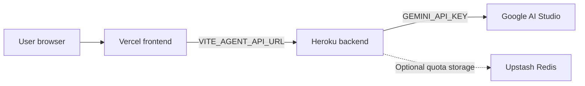

# DataSnap Deployment Guide

> **Deploy DataSnap directly from GitHub.**
>
> DataSnap is a decision-intelligence app: a user uploads a dataset, asks a business question, and receives a report with verified metrics, charts, and recommendations.
>
> This guide is written for beginners. The main path uses the **Heroku and Vercel dashboards**. No cloning, terminal, or command-line deployment is required.

## What You Are Deploying

DataSnap has two separate parts:

| Part | Deploy to | What it does |
| --- | --- | --- |
| Backend | Heroku | Runs FastAPI, Gemini analysis, file processing, and rate limiting |
| Frontend | Vercel | Hosts the React website users open in their browser |



### The three URLs you will use

| Name | Example | Where it is used |
| --- | --- | --- |
| GitHub repository | `https://github.com/your-name/ai_agent_01` | Source code for both deployments |
| Heroku backend URL | `https://your-app.herokuapp.com` | Vercel's `VITE_AGENT_API_URL` |
| Vercel frontend URL | `https://your-project.vercel.app` | Heroku's `CORS_ALLOWED_ORIGINS` |

## What You Need Before Starting

Create or open these accounts:

- GitHub: access to the repository you want to deploy.
- Heroku: an account at [dashboard.heroku.com](https://dashboard.heroku.com/).
- Vercel: an account at [vercel.com](https://vercel.com/), connected to GitHub.
- Google AI Studio: an account at [aistudio.google.com](https://aistudio.google.com/) for the Gemini key.
- Upstash: optional, only for shared persistent rate-limit storage.

> **Important:** Deploy from the GitHub repository. Do not upload `.env` files, API keys, Redis tokens, or passwords to GitHub.

## Step 1: Get the Gemini API Key

1. Open [Google AI Studio](https://aistudio.google.com/).
2. Sign in with Google.
3. Select an existing Google project or create one.
4. Click **Get API key**.
5. Create or copy the API key.
6. Keep this browser tab open. You will paste the key into Heroku, not Vercel.

The Gemini key is a backend secret. Never create a Vercel variable called `VITE_GEMINI_API_KEY`; anything beginning with `VITE_` is visible in the browser.

## Step 2: Deploy the Backend on Heroku

### Create a Heroku app

1. Open the [Heroku Dashboard](https://dashboard.heroku.com/).
2. Click **New** in the top-right corner.
3. Select **Create new app**.
4. Enter a unique **App name**, for example `datasnap-api-yourname`.
5. Choose a region.
6. Click **Create app**.

Heroku will show the backend URL near the top of the app page. It looks like:

```text
https://your-app-name.herokuapp.com
```

Copy this URL. You will need it when setting up Vercel.

### Connect the GitHub repository

1. Open the Heroku app's **Deploy** tab.
2. Under **Deployment method**, select **GitHub**.
3. Click **Connect to GitHub** and authorize Heroku if asked.
4. Search for `ai_agent_01`.
5. Select the repository you want to deploy.
6. Select the `main` branch.
7. Click **Enable Automatic Deploys** only if you want every future push to deploy automatically.
8. Click **Deploy Branch**.

Wait for Heroku to show **Your app was successfully deployed**.

> The repository already contains the root `Procfile`, `requirements.txt`, and Heroku process configuration. Do not set Heroku's root directory to `backend`; deploy the repository root.

### Add Heroku Config Vars in Settings

1. Open the Heroku app.
2. Click the **Settings** tab.
3. Scroll to **Config Vars**.
4. Click **Reveal Config Vars**.
5. Add each variable below using the **Key** and **Value** fields.
6. Click **Add** after each one.

Start with these values. Replace only the values marked with `<...>`:

| Key | Value to enter | Required |
| --- | --- | :---: |
| `LLM_PROVIDER` | `gemini` | Yes |
| `GEMINI_API_KEY` | Paste the key from Google AI Studio | Yes |
| `GEMINI_MODEL` | `gemini-3.1-flash-lite` | Yes |
| `GEMINI_FALLBACK_MODELS` | `gemini-3.5-flash-lite,gemini-2.5-flash-lite` | No |
| `CORS_ALLOWED_ORIGINS` | Temporary: `https://your-project.vercel.app` | Yes |
| `COOKIE_SECURE` | `true` | Yes |
| `RATE_LIMIT_SECRET` | Any long random private value | Yes |
| `MAX_REQUESTS_PER_HOUR` | `5` | No |
| `MAX_RETRY_COUNT` | `3` | No |
| `EXECUTION_TIMEOUT_SECONDS` | `45` | No |
| `MAX_UPLOAD_SIZE_BYTES` | `52428800` | No |

For `RATE_LIMIT_SECRET`, use a long random sentence or generate one with a password manager. Do not share it publicly.

`CORS_ALLOWED_ORIGINS` will be updated with the real Vercel URL after the frontend is deployed. Do not add `/analyze` or a trailing slash.

### Check the backend

Open this URL in a browser, replacing the app name:

```text
https://your-app-name.herokuapp.com/health
```

You should see:

```json
{"status":"ok"}
```

If you see an error, open Heroku's **More** menu and select **View logs**.

## Step 3: Deploy the Frontend on Vercel

1. Open [Vercel](https://vercel.com/).
2. Click **Add New...** → **Project**.
3. Find the same GitHub repository.
4. Click **Import**.
5. In **Configure Project**, set **Root Directory** to:

   ```text
   frontend
   ```

6. Keep the framework as **Vite**.
7. Open the **Environment Variables** section.
8. Add this variable:

   | Key | Value |
   | --- | --- |
   | `VITE_AGENT_API_URL` | `https://your-app-name.herokuapp.com` |

   Do not add `/api/v1/analyze` to the end. Use only the Heroku base URL.

9. Make sure the variable is enabled for **Production**. Enable Preview too if you want preview deployments to use the backend.
10. Click **Deploy**.

When deployment finishes, Vercel will show the frontend URL, for example:

```text
https://datasnap-yourname.vercel.app
```

Copy the complete URL from the browser address bar. Do not include a path or trailing slash.

## Step 4: Connect Vercel to Heroku with CORS

Return to the Heroku app:

1. Open **Settings**.
2. Scroll to **Config Vars**.
3. Find `CORS_ALLOWED_ORIGINS`.
4. Click its edit/pencil button.
5. Replace the temporary value with the exact Vercel origin, for example:

   ```text
   https://datasnap-yourname.vercel.app
   ```

6. Save the value.

Correct:

```text
https://datasnap-yourname.vercel.app
```

Incorrect:

```text
https://datasnap-yourname.vercel.app/
https://datasnap-yourname.vercel.app/analyze
http://datasnap-yourname.vercel.app
```

Heroku normally restarts the app after a Config Var changes. If it does not, open the app's **More** menu and choose **Restart all dynos**.

## Step 5: Test the Complete App

Open the Vercel URL and check this workflow:

- Open the home page.
- Click **Analyze**.
- Refresh the browser while on `/analyze`; it should still load, not show a Vercel 404.
- Upload `backend/data/sample_sales_data.csv` from the repository.
- Enter a business question.
- Click **Run analysis**.
- Confirm the report opens at `/report/<analysis-id>`.
- Save the report.
- Open **Reports** and confirm the saved report is visible.

> The first real Gemini request may take time and uses Gemini quota. The backend also supports `provider=mock` for local/testing scenarios, but the deployed frontend intentionally uses Gemini.

## Environment Variable Reference

| Variable | Get the value from | Add it in | What it controls |
| --- | --- | --- | --- |
| `LLM_PROVIDER` | Type `gemini` | Heroku Settings → Config Vars | Selects Gemini |
| `GEMINI_API_KEY` | Google AI Studio → **Get API key** | Heroku only | Gemini authentication |
| `GEMINI_MODEL` | Use `gemini-3.1-flash-lite` | Heroku | Primary model |
| `GEMINI_FALLBACK_MODELS` | Model names, comma-separated | Heroku | Retry fallback models |
| `CORS_ALLOWED_ORIGINS` | Vercel production URL | Heroku | Allows the frontend origin |
| `COOKIE_SECURE` | Type `true` | Heroku | Secure HTTPS cookies |
| `RATE_LIMIT_SECRET` | Create a private random value | Heroku only | Signs quota identity |
| `MAX_REQUESTS_PER_HOUR` | Choose a number, normally `5` | Heroku | Anonymous analysis limit |
| `MAX_RETRY_COUNT` | Normally `3` | Heroku | Generated-code repair attempts |
| `EXECUTION_TIMEOUT_SECONDS` | Normally `45` | Heroku | Analysis subprocess limit |
| `MAX_UPLOAD_SIZE_BYTES` | Normally `52428800` | Heroku | 50 MB upload limit |
| `VITE_AGENT_API_URL` | Heroku app URL | Vercel only | Tells the browser where the API is |

### Optional Upstash variables

Use Upstash only when you need rate limits shared across dynos or preserved after restarts:

| Key | Get the value from | Add it in |
| --- | --- | --- |
| `UPSTASH_REDIS_REST_URL` | Upstash database → REST URL | Heroku Config Vars |
| `UPSTASH_REDIS_REST_TOKEN` | Upstash database → REST token | Heroku Config Vars |

Create the database at [upstash.com](https://upstash.com/), open its **REST API** section, copy both values, and paste them into Heroku. Never paste either value into Vercel.

## Common Errors

### Vercel says `404: NOT_FOUND` for `/analyze`

In Vercel:

1. Open **Project Settings**.
2. Open **General**.
3. Confirm **Root Directory** is `frontend`.
4. Confirm the deployed branch includes `frontend/vercel.json`.
5. Redeploy from the **Deployments** tab.

### Browser says `CORS policy`

First look at the Network tab status code. Then check:

- Heroku `CORS_ALLOWED_ORIGINS` exactly matches the Vercel URL.
- The value uses `https://`.
- There is no trailing slash or `/analyze` path.
- `VITE_AGENT_API_URL` points to Heroku, not Vercel.
- Heroku restarted after the Config Var changed.

A Heroku `503` can appear as a misleading CORS error because Heroku's error page does not include the CORS header.

### Browser or Postman says `429 Too Many Requests`

The default limit is five analyses per rolling hour. Wait until the reset time, or change `MAX_REQUESTS_PER_HOUR` in Heroku Config Vars. Repeated failed tests may also consume quota.

### Heroku says `503`, `H13`, or `WORKER TIMEOUT`

Open the Heroku app's **More** menu → **View logs**. Gemini analysis is synchronous and can be slow. The worker timeout is extended, but Heroku's router still has a short request limit. If real analyses regularly exceed that limit, the long-term fix is a background job with a status-polling endpoint.

### Gemini key or quota error

Open Heroku **Settings** → **Config Vars** and confirm:

- `GEMINI_API_KEY` exists and has no extra spaces.
- `LLM_PROVIDER` is exactly `gemini`.
- The Google AI Studio project and model have available quota.
- The key was not added to Vercel.

## Final Checklist

- [ ] Heroku app was deployed from the GitHub repository's `main` branch.
- [ ] Heroku **Config Vars** contain the Gemini key and backend settings.
- [ ] Heroku `/health` returns `{"status":"ok"}`.
- [ ] Vercel imported the same GitHub repository.
- [ ] Vercel **Root Directory** is `frontend`.
- [ ] Vercel **Environment Variables** contain `VITE_AGENT_API_URL`.
- [ ] `CORS_ALLOWED_ORIGINS` is the exact Vercel production URL.
- [ ] `/analyze` works when opened directly.
- [ ] A dataset can be uploaded and analyzed.
- [ ] No API key, Redis token, password, or `.env` file was committed to GitHub.

## Important Product Notes

- Saved reports are stored in the current browser, not in a shared user account.
- Backend report records are held in process memory and are not a permanent database.
- Generated code runs in a timed subprocess; this is not a hardened multi-tenant sandbox.
- Correlation and statistical significance do not prove causation. Reports still need human review.

## Optional: Command-Line Deployment

The dashboard workflow above is recommended for beginners. Experienced users can deploy from the repository root with the Heroku CLI, but it is not required for this project.
